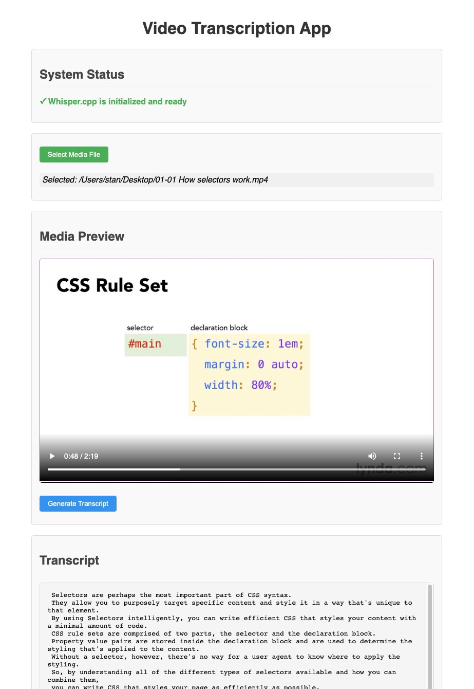

# Video & Audio Transcription App

An Electron desktop application for transcribing videos and audio files using Whisper.cpp, an efficient implementation of OpenAI's Whisper speech-to-text model.



## Features

- Transcribe video files (MP4, WebM, MOV, AVI) and audio files (MP3, WAV, M4A, OGG, FLAC)
- Built-in media player for previewing content
- Uses on-device processing (no cloud API required)
- Save transcriptions as text files
- Cross-platform support (Windows, macOS, Linux)
- Fast transcription using Whisper.cpp optimized library


### Prerequisites

- Node.js 14.x or higher
- npm 6.x or higher
- Git
- CMake 3.10+
- C++ compiler (GCC, Clang, or MSVC)
- Python 3.6+

#### Building Steps

1. Clone the repository:

   ```sh
   git clone `github project URL`
   cd `app folder`
   ```

2. Install dependencies:

   ```sh
   npm install
   ```

3. Build the project:

   ```sh
   npm run build
   ```

4. Start the application in local environment:

   ```sh
   npm start
   ```

5. Package the application for distribution:

```sh
 npm package
```

## Usage

1. Launch the application.
2. Wait for Whisper.cpp to be initialized (may take a moment on first run).
3. Click "Select Media File" and choose a video or audio file.
4. Preview your media in the built-in player.
5. Click "Generate Transcript" to start transcribing.
6. Once complete, the transcript will appear in the window.
7. Click "Save Transcript" to save the result as a text file.

## Available Scripts

The application includes several utility scripts for development and maintenance:

| Script                       | Description                                                                     |
| ---------------------------- | ------------------------------------------------------------------------------- |
| `npm run start`              | Builds the app and launches it in development mode                              |
| `npm run dev`                | Runs the app in development mode with hot reload                                |
| `npm run build`              | Compiles the frontend UI using Rollup                                           |
| `npm run prepackage`         | Generates app icons (runs automatically before packaging)                       |
| `npm run package`            | Builds and packages the app for distribution using electron-builder             |
| `npm run download-whisper`   | Downloads the pre-compiled Whisper.cpp binary if available for your platform    |
| `npm run build-whisper`      | Builds Whisper.cpp from source code when pre-compiled binaries aren't available |
| `npm run check-binary`       | Verifies that the Whisper.cpp binary is properly installed and executable       |
| `npm run check-source`       | Checks if the Whisper.cpp source code is properly downloaded                    |
| `npm run test-transcription` | Runs a test transcription with a sample audio file to verify functionality      |
| `npm run create-launcher`    | Creates platform-specific launcher scripts for Whisper.cpp binary               |

### Initialization Issues

If you encounter problems with Whisper.cpp initialization:

- Check that your system meets the requirements
- For developers: Make sure development tools (CMake, compiler) are properly installed
- On some systems, you may need to specify custom paths to tools

### Transcription Issues

If transcription fails:

- Check if the audio in your file is clear and audible
- Very large files may require more memory
- Try a shorter clip first to test functionality

## Advanced Configuration

### Models

The app uses the `base.en` model by default, which is good for English transcription with a reasonable balance between accuracy and speed.

Other model options include:

- `tiny.en`: Fastest, less accurate
- `small.en`: More accurate than tiny but still fast
- `medium.en`: Very accurate but slower and uses more RAM
- `large`: Most accurate, slowest, highest RAM usage

### Command Line Options

Advanced users can run the binary with custom parameters:

This will perform a diagnostic test and show the exact command being used.

## Technical Details

- Built with Electron and Svelte
- Uses Whisper.cpp for transcription (<https://github.com/ggerganov/whisper.cpp>)
- FFmpeg for audio extraction
- Models are automatically downloaded at first run

### Project Structure

electron-transcription-app/
├── public/ # Static web assets
├── resources/ # Icons and resources
├── scripts/ # Helper scripts
├── src/ # Svelte source code
├── transcription/ # Transcription logic
├── vendor/ # Whisper.cpp and models
├── electron.js # Main process
└── preload.js # Preload script

## Performance Tips

- Transcription speed depends on your computer's CPU power
- SSE3/AVX2 instructions dramatically improve performance
- RAM usage scales with model size and audio length
- Transcribing a 5-minute audio file takes approximately:
  - 30 seconds with the `tiny` model
  - 1 minute with the `base` model
  - 3 minutes with the `small` model
  - 10+ minutes with larger models

## License

MIT © Stan

## Acknowledgments

- [Whisper.cpp](https://github.com/ggerganov/whisper.cpp) - Efficient C++ implementation of OpenAI's Whisper model
- [OpenAI Whisper](https://github.com/openai/whisper) - The original Whisper model
- [Electron](https://electronjs.org/) - Cross-platform desktop framework
- [Svelte](https://svelte.dev/) - UI framework
